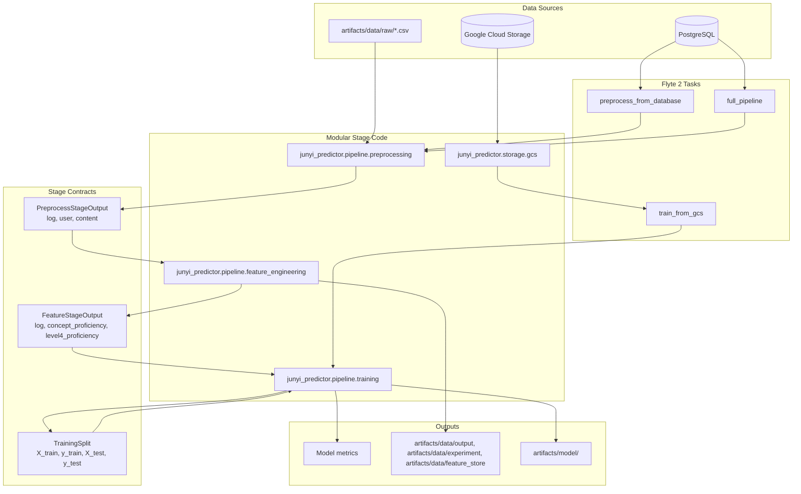

# Application Flow

## Notes

- `orchestration/flyte_app.py` is the current Flyte 2 entrypoint.
- Runtime code is intentionally split into preprocessing, feature engineering, and training stages.
- GCS access stays in `junyi_predictor.storage.gcs` so storage concerns do not leak into stage logic.
- Dataclass stage contracts are the main seams between modules.
