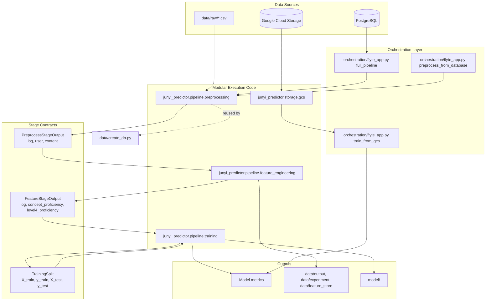

# Current System Design

## Notes

- `orchestration/flyte_app.py` is the main Flyte 2 execution entrypoint today.
- The core runtime is now stage-based: preprocessing, feature engineering, then training.
- Each stage exposes an explicit contract to reduce cross-stage coupling.
- GCS access is isolated in `junyi_predictor.storage.gcs`.
- Tests cover stage behavior and stage-to-stage integration boundaries in `tests/`.
