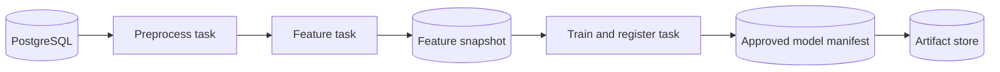

# Flyte-on-GKE Implementation Plan

## Goal

Build a reproducible student-performance training pipeline that is testable as
plain Python, runnable locally without cloud resources, and demonstrable as a
remote Flyte OSS workflow on an ephemeral GKE cluster. The first remote
milestone trains and registers one approved model. Batch inference and
monitoring follow after the model-registration contract is stable.

## Architecture decision

Flyte OSS on GKE is the target platform. Kubernetes provides pod execution,
identity, and networking; Flyte provides workflow composition, task-level
resources, retries, caching, schedules, and run history.

| Approach | Benefits | Costs |
| --- | --- | --- |
| Kubernetes Jobs and CronJobs only | Small platform footprint and direct Kubernetes control | Artifact handoff, retries, dependencies, and run history must be built separately |
| Flyte OSS on GKE | Native ML task boundaries, task environments, and observable runs | Adds a Flyte control plane, metadata storage, artifact storage, and remote deployment configuration |

The repository must not schedule `flyte run --local` inside a Kubernetes
CronJob. Helm deploys Flyte; Flyte deploys Junyi task pods and owns the
application schedule.

## Application architecture

- PostgreSQL stores source, processed, and relational feature data.
- The artifact store holds run-scoped feature matrices, model bundles, scalers,
  metrics, manifests, and the approved-model pointer.
- `PipelineRun`, `FeatureSnapshot`, and `ModelRegistration` provide durable
  typed contracts between stages.
- Model bundles are immutable under `models/<run-id>/`; `models/approved.json`
  points to the selected model.
- Training uses chronological partitions and fits transformations only on
  training data.

All tasks initially share one pinned runtime image while using distinct Flyte
environments: `junyi-preprocess`, `junyi-features`, and `junyi-training`.
Split images only after package or hardware requirements differ.

## Delivery stages

### 1. Correct, modular pipeline

- Complete contracts, settings, local/GCS artifact adapters, and model registry.
- Materialize run outputs and register the best candidate model, scaler, schema,
  and metrics.
- Add regression tests for causal features and train-only scaling.

### 2. Image and Helm packaging

- Maintain one runtime Dockerfile and restrictive `.dockerignore`.
- Use `infra/helm/local-postgres` for the development database.
- Use `infra/helm/flyte` as the values overlay for a pinned Flyte OSS chart.

### 3. Local end-to-end environment

1. Create kind from `infra/local/kind.yaml`.
2. Install PostgreSQL with `make postgres-local`.
3. Download Kaggle data and seed PostgreSQL source tables.
4. Run `make flyte-training-local` using the kind NodePort database URL.
5. Verify a feature snapshot, model bundle, metrics, manifest, and approved
   model pointer under `artifacts/runs/`.

Flyte local mode validates composition and durable interfaces from the host. A
separate kind image smoke test validates container-to-PostgreSQL networking.
Remote per-task container execution is validated only in GKE.

### 4. Ephemeral cloud demonstration

1. Apply `infra/terraform/bootstrap` to create the remote state bucket.
2. Initialize and apply `infra/terraform/demo` with a pinned Flyte chart version
   and securely supplied database password.
3. Build and push the runtime image to Artifact Registry.
4. Deploy Flyte OSS with Helm, configure its task identity, and register the
   workflow with `flyte deploy`.
5. Execute one remote training run and inspect Flyte actions, Cloud SQL rows,
   GCS artifacts, and the approved-model manifest.
6. Destroy the demo Terraform environment immediately after verification.

## Terraform boundary

| Local only | Cloud demonstration only |
| --- | --- |
| Python tests and lint | Artifact Registry image push |
| Docker image build | GKE Autopilot and Flyte OSS |
| kind and local PostgreSQL | Cloud SQL PostgreSQL |
| Flyte local-mode run | GCS artifact and model registry |
| Filesystem artifact store | Workload Identity and remote task pods |

The bootstrap configuration creates a versioned GCS state bucket. The demo
configuration creates a VPC/subnet, private-service connection, GKE Autopilot,
Artifact Registry, an artifact bucket, Cloud SQL PostgreSQL databases, and a
least-privilege task identity. Terraform connects Helm and Kubernetes providers
to GKE using its endpoint, access token, and CA certificate.

Workload Identity maps the Flyte task Kubernetes service account to a Google
service account with bucket-scoped object access and Cloud SQL client access.
Database credentials are sensitive deployment input; never commit them or mount
GCP service-account keys.

## Acceptance criteria

- Unit tests cover pure stages, settings, artifact stores, and model registry.
- Integration tests cover the Helm-installed local PostgreSQL workflow path.
- Helm lint and rendering pass for the local PostgreSQL chart.
- Terraform validates for bootstrap and demo configurations.
- A manually gated cloud run records remote Flyte task actions and is destroyed
  afterwards to prevent unbudgeted recurring charges.
