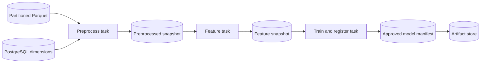

# Flyte-on-GKE Implementation Plan

## Goal

Build a reproducible student-performance training pipeline that is testable as
plain Python, runnable locally without cloud resources, and demonstrable as a
remote Flyte OSS workflow on an ephemeral GKE cluster. The first remote
milestone trains and registers one approved model. Batch inference and
monitoring follow after the model-registration contract is stable.

## Architecture decision

Flyte OSS on GKE is the target platform. Kubernetes provides pod execution,
identity, and networking; Flyte provides workflow composition, task-level
resources, retries, caching, schedules, and run history.

| Approach | Benefits | Costs |
| --- | --- | --- |
| Kubernetes Jobs and CronJobs only | Small platform footprint and direct Kubernetes control | Artifact handoff, retries, dependencies, and run history must be built separately |
| Flyte OSS on GKE | Native ML task boundaries, task environments, and observable runs | Adds a Flyte control plane, metadata storage, artifact storage, and remote deployment configuration |

The repository must not schedule `flyte run --local` inside a Kubernetes
CronJob. Helm deploys Flyte; Flyte deploys Junyi task pods and owns the
application execution. Automatic scheduling is disabled for the cloud MVP.

The target split between Terraform, Helm, and Flyte workflow code is documented
in [cloud configuration ownership and migration plan](cloud-configuration-ownership.md).

## Application architecture



- The data lake stores immutable raw CSV and cleaned, date-partitioned Parquet
  event history used for training.
- PostgreSQL stores small relational dimensions, processed run outputs, and
  relational feature data; it does not store the complete event history.
- The artifact store holds run-scoped feature matrices, model bundles, scalers,
  metrics, manifests, and the approved-model pointer.
- Frozen Pydantic `PipelineRun`, `PreprocessedSnapshot`, `FeatureSnapshot`, and
  `ModelRegistration` models provide durable typed contracts between stages.
- Flyte task boundaries exchange JSON-compatible model dumps; each receiving
  task validates its payload before loading run-scoped artifacts.
- Model bundles are immutable under `models/<training-run-id>/`; `models/approved.json`
  points to the selected model.
- Training uses chronological partitions and fits transformations only on
  training data.

### First stage-decoupling increment

`train_from_features` is an independent manual entrypoint that reuses a retained
feature snapshot and creates a new training-run identity. It registers the
selected candidate without changing the approved pointer. The existing combined
workflow is manually invoked and continues to promote its selected model.

Both entrypoints select their input rows before a configurable chronological
70/15/15 train-validation-test split. Validation selects the candidate; only the
winner is evaluated on test data. Metadata records source fingerprints, row
selection, split boundaries, and model configuration. Old registration manifests
remain readable and no database migration is required. See the
[standalone training runbook](training-from-features.md).

The remaining decoupling sequence in
[issue #7](https://github.com/linhsinp/junyi-online-learning-prediction/issues/7)
is independent preprocessing, complete database feature publications,
database-backed training, incremental feature state, promotion/recovery policy,
and finally independent scheduling and operational cutover. Existing commands
remain usable at each transition.

A separate experiment-configuration increment will expose hyperparameters and
selection of existing features through validated YAML, retaining the resolved
configuration with each run. Optional MLflow comparison follows afterward; it
does not replace Flyte orchestration or the current registration contract. See
[the proposal and acceptance criteria](experiment-configuration.md).

The optional [DVC and MLflow integration proposal](dvc-mlflow-integration-plan.md)
preserves a local-first, two-stage design for dataset releases and experiment
tracking. It is deferred until after the cloud MVP and reconciliation of issue
#7's storage requirements; neither integration is required for the first remote
demonstration.

All tasks initially share one pinned runtime image while using distinct Flyte
environments: `junyi-preprocess`, `junyi-features`, and `junyi-training`.
Split images only after package or hardware requirements differ.

## Delivery stages

### 1. Correct, modular pipeline

- Complete contracts, settings, local/GCS artifact adapters, and model registry.
- Materialize run outputs and register the best candidate model, scaler, schema,
  and metrics.
- Add regression tests for causal features and train-only scaling.

### 2. Image and Helm packaging

- Maintain one runtime Dockerfile and restrictive `.dockerignore`.
- Use `infra/helm/local-postgres` for the development database.
- Use `infra/helm/flyte` as the values overlay for a pinned Flyte OSS chart.

### 3. Local end-to-end environment

1. Create kind from `infra/local/kind.yaml`.
2. Install PostgreSQL with `make postgres-local`.
3. Run `make download-data`, then `make materialize-parquet` to create
   year/month-partitioned training events under `artifacts/data/curated/`.
4. Run `make seed-local` to seed only PostgreSQL dimension tables. Before
   reseeding an existing local database, run `make reset-local` to recreate the
   local schema.
5. Run `make flyte-training-local` using the kind NodePort database URL.
6. Verify preprocessed and feature snapshots, a model bundle, metrics, manifest, and approved
   model pointer under `artifacts/runs/`.

Flyte local mode validates composition and durable interfaces from the host. A
separate kind image smoke test validates container-to-PostgreSQL networking.
Remote per-task container execution is validated only in GKE.

The local workflow has three task boundaries: preprocessing persists the
preprocessed log and dimensions under `runs/<run-id>/preprocessed/`; feature
engineering consumes that snapshot and writes `runs/<run-id>/features/`; training
consumes the feature snapshot and registers the model.

Use `make flyte-training-local-tui` for an interactive display of a newly
launched local run. The TUI is local-only; browser-based Flyte run history and
per-task Kubernetes pods require the stage 4 Flyte OSS deployment.

### Cloud-MVP prerequisites

The cloud demonstration is manually gated and requires an authenticated local
operator. Install the following before provisioning anything:

| Requirement | Purpose | Verify |
| --- | --- | --- |
| Google Cloud CLI and GKE authentication plugin | Authenticate, manage the project, push images, and inspect GKE | `gcloud version`, `gke-gcloud-auth-plugin --version` |
| Terraform 1.6 or newer | Provision bootstrap and demo infrastructure | `terraform version` |
| Docker Engine | Build and push the runtime image | `docker version` |
| Helm and `kubectl` | Validate charts and inspect the remote deployment | `helm version --short`, `kubectl version --client` |
| `uv` | Run the repository's pinned Python and Flyte dependencies | `uv --version`, `uv run flyte --help` |

Create or select a dedicated billed GCP project, then run `gcloud init` and
select that project. Local Terraform and Python GCS clients use Application
Default Credentials, which are separate from the CLI login:

```sh
gcloud auth login
gcloud config set project YOUR_PROJECT_ID
gcloud auth application-default login
gcloud auth application-default set-quota-project YOUR_PROJECT_ID
gcloud auth application-default print-access-token >/dev/null
```

The final command verifies local credentials without printing a token. The
operator needs permission to enable the configured APIs and to create the GCS,
networking, GKE, Artifact Registry, Cloud SQL, service-account, IAM, Helm, and
Kubernetes resources declared in Terraform. A dedicated personal demo project
can use Project Owner access; shared projects should grant the corresponding
least-privilege roles through the project administrator.

Do not install Flyte globally for this repository. The checked-in `uv.lock`
provides the CLI used by the deployment commands. The GKE authentication plugin
is needed for Helm deployment and direct `kubectl` inspection. Terraform uses
only its Google provider. If its verification command is unavailable in
a Google Cloud CLI installation that supports component management, install it
with `gcloud components install gke-gcloud-auth-plugin`.

### 4. Ephemeral cloud demonstration

1. Apply `infra/terraform/bootstrap` to create the remote state bucket.
2. Initialize and apply `infra/terraform/demo` with a securely supplied database password.
3. Build and push the runtime image to Artifact Registry.
4. Upload the selected curated Parquet partitions to the Terraform-provisioned
   data-lake bucket with `make upload-curated-data DATA_LAKE_BUCKET=...`.
5. Generate Helm values from Terraform outputs; install the Junyi and pinned
   Flyte releases, seed dimensions, and register the workflow with `flyte deploy`.
   Follow the [cloud MVP runbook](cloud-mvp-runbook.md) for exact commands.
6. Execute one remote training run with `DATA_LAKE_BACKEND=gcs`,
   `DATA_LAKE_BUCKET`, and the selected data-lake prefix configured in the task
   environment; inspect Flyte actions, Cloud SQL rows,
   GCS artifacts, and the approved-model manifest.
7. Uninstall both Helm releases, then destroy the demo Terraform environment.

## Terraform boundary

| Local only | Cloud demonstration only |
| --- | --- |
| Python tests and lint | Artifact Registry image push |
| Docker image build | GKE Autopilot and Flyte OSS |
| kind and local PostgreSQL | Cloud SQL PostgreSQL |
| Flyte local-mode run | GCS artifact and model registry |
| Filesystem artifact store | Workload Identity and remote task pods |

The bootstrap configuration creates a versioned GCS state bucket. The demo
configuration creates a VPC/subnet, private-service connection, GKE Autopilot,
Artifact Registry, separate data-lake and artifact buckets, Cloud SQL PostgreSQL databases, and a
least-privilege task identity. Terraform exposes cloud outputs; Helm uses them
to configure the Junyi project and Flyte platform through the GKE kubeconfig.

Workload Identity maps the Flyte task Kubernetes service account to a Google
service account with bucket-scoped object access and Cloud SQL client access.
Database credentials are sensitive deployment input; never commit them or mount
GCP service-account keys.

## Acceptance criteria

- Unit tests cover pure stages, settings, artifact stores, and model registry.
- Integration tests cover the Helm-installed local PostgreSQL workflow path.
- Helm lint and rendering pass for the local PostgreSQL chart.
- Terraform validates for bootstrap and demo configurations.
- A manually gated cloud run records remote Flyte task actions and is destroyed
  afterwards to prevent unbudgeted recurring charges.
