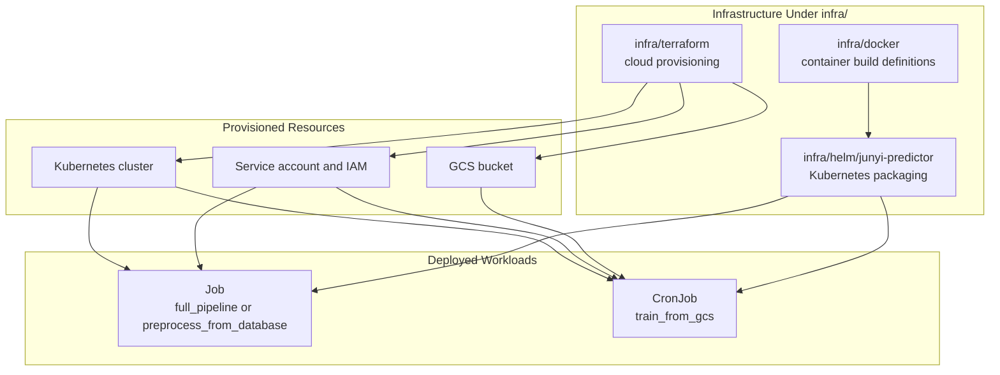

# Infrastructure Design

## Notes

- `infra/terraform/` owns shared cloud resources and provider-side provisioning.
- `infra/docker/` owns buildable container images for runtime workloads.
- `infra/helm/junyi-predictor/` owns Kubernetes workload definitions and runtime configuration.
- Helm and Terraform are intentionally separated so cluster rollout logic does not get mixed into cloud provisioning.
