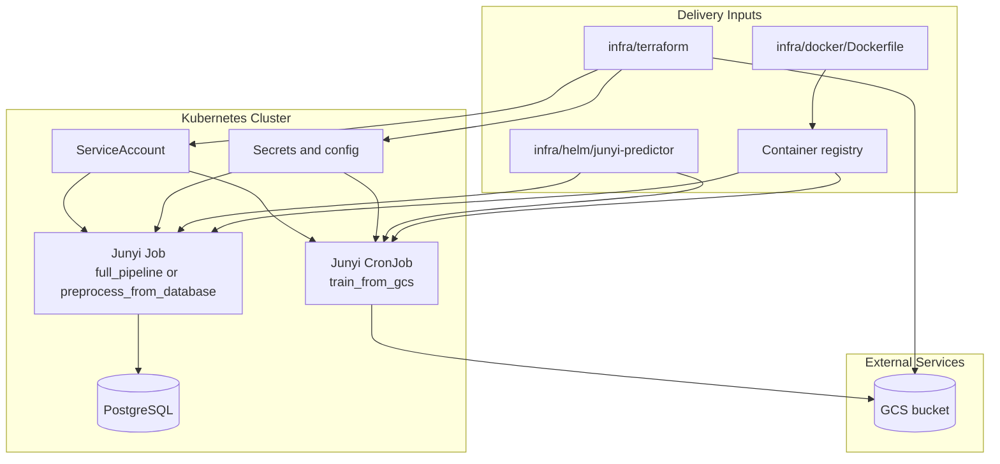

# Kubernetes Deployment Checklist

This repository does not deploy as a single long-running web app. The current target model is batch-oriented runtime jobs on Kubernetes.

## Core Components

1. Kubernetes cluster
- Runs the Junyi predictor workloads as `Job` or `CronJob` resources from [infra/helm/junyi-predictor](/Users/hsin-pei/Desktop/github_repo/junyi-online-learning-prediction/infra/helm/junyi-predictor).

2. Junyi runtime image
- Built from [infra/docker/Dockerfile](/Users/hsin-pei/Desktop/github_repo/junyi-online-learning-prediction/infra/docker/Dockerfile).
- Must be pushed to an image registry that the cluster can pull from.

3. PostgreSQL database
- Required for `preprocess_from_database` and `full_pipeline`.
- Exposed to the jobs through `DATABASE_URL`.
- Can run in-cluster, but a managed database is usually a better production choice.

4. Object storage
- `train_from_gcs` depends on Google Cloud Storage through [gcs.py](/Users/hsin-pei/Desktop/github_repo/junyi-online-learning-prediction/junyi_predictor/storage/gcs.py).
- Requires the expected `feature_store/` files in the bucket.

5. Secrets and identity
- Kubernetes secret for `DATABASE_URL`.
- GCP credentials or workload identity for bucket access.
- Kubernetes service account bound to the runtime workload.

6. Helm deployment
- The chart in [infra/helm/junyi-predictor](/Users/hsin-pei/Desktop/github_repo/junyi-online-learning-prediction/infra/helm/junyi-predictor) packages the runtime into Kubernetes `Job` and `CronJob` resources.
- Use the values files as workload-specific starting points.

7. Provisioned infrastructure
- Shared cloud resources such as buckets and IAM should stay in [infra/terraform](/Users/hsin-pei/Desktop/github_repo/junyi-online-learning-prediction/infra/terraform), not in the Helm chart.

## Current Runtime Model

The deployed pods currently run `flyte run --local orchestration/flyte_app.py ...` inside the container. That means:

- Kubernetes is the scheduler and execution environment.
- Flyte is used inside the pod as a local task runner.
- This is not yet a full remote Flyte control-plane deployment.

## Recommended Deployment Sequence

1. Provision shared infrastructure with Terraform.
2. Build and push the Junyi runtime image.
3. Create Kubernetes secrets and service accounts.
4. Deploy the Helm chart with the correct values file.
5. Verify job logs, database connectivity, and GCS access.
6. Automate image build and Helm deployment in CI/CD.
