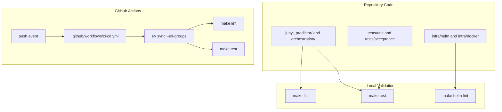

# Quality and Delivery

## Notes

- Unit and acceptance coverage are separated under `tests/`.
- CI currently validates Python code on every push with `uv`, `make lint`, and `make test`.
- Helm validation is available locally through `make helm-lint` and complements the Python test flow.
